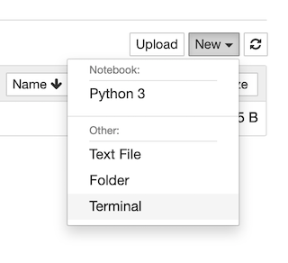
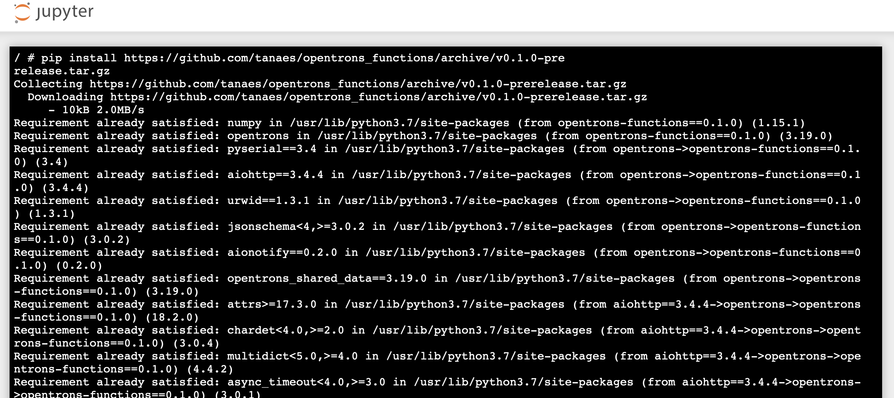

# opentrons_functions
A collection of functions compatible with the Opentrons API.

## Installation

To install on your Unix-based machine, you can simply point `pip` to this git repository:

```{bash}
pip install git+https://github.com/tanaes/opentrons_functions.git
```

The easiest way to install this library is via the Jupyter Notebook server on your OT-2. Follow the [instructions on the Opentrons site](https://support.opentrons.com/en/articles/1795367-running-the-robot-using-jupyter-notebook) for connecting.

Then, use the Jupyter interface to launch a new terminal. On the right side of the screen, click the 'New' button, and select 'Terminal.' This will give you terminal access to the OT-2 Linux system.



The OT-2 does not have `git` installed, so you must point `pip` to one of the [release](https://github.com/tanaes/opentrons_functions/releases) tarballs instead. For example:

```{bash}
pip install https://github.com/tanaes/opentrons_functions/archive/v0.1.0-pre
release.tar.gz
```

If this is successful, you should see a long dialogue of dependencies (most or all should already be installed):


